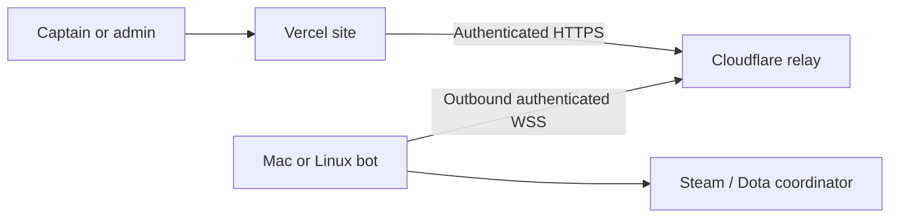

# Steam / Dota lobby bot

The current rollout is **one bot for the current active in-house game**, using **Captains Mode (2)** and **US East (2)**. Captains/admins create and start the lobby from the in-house room; participants can see credentials and status. Draft completion alone does not create or launch a Dota lobby. Season support is implemented but its UI and API stay disabled unless the server explicitly sets `DOTA_SEASON_LOBBY_BOT_ENABLED="true"`.

## Architecture and research

Lobby creation uses a Steam client session and the Dota Game Coordinator (GC). The existing Steam Web API key/OpenID login cannot supply that session, and signing into the desktop Steam app does not sign in the worker. The web app sends authenticated requests through `ops/dota-lobby-relay` on Cloudflare to the separate Node 22 service in `ops/dota-lobby-bot`. The bot opens an outbound WebSocket to the relay and stays logged in to Steam. Its host needs no public IP, inbound firewall port, domain, or temporary tunnel.

The worker runs on macOS or Linux with Node 22 and persistent private storage. It does not need the Steam desktop app, the Dota download, a GPU, or ChatGPT to remain open. A Mac running the bot can coexist with a PC playing Dota on a different Steam account. Windows would require a Linux environment such as WSL; that path has not been tested.



Primary sources inspected September 4, 2026:

- [SteamUser documentation](https://github.com/DoctorMcKay/node-steam-user): login, Steam Guard, persistent login data, and `gamesPlayed`.
- [Steam Session documentation](https://github.com/DoctorMcKay/node-steam-session): QR/password sign-in and SteamClient refresh tokens.
- [Dota2User setup](https://github.com/itsjfx/node-dota2-user/blob/master/docs/setup.md): attach the GC adapter to SteamUser and wait for the GC connection.
- [Dota lobby request protobufs](https://github.com/SteamDatabase/Protobufs/blob/master/dota2/dota_gcmessages_client_match_management.proto): `CMsgPracticeLobbyCreate`, nested lobby details, `leagueid`, game mode, region, launch and leave messages. SteamDatabase tracks Valve's shipped protocol definitions.
- [Dota shared lobby protobufs](https://github.com/SteamDatabase/Protobufs/blob/master/dota2/dota_gcmessages_common_lobby.proto): authoritative lobby snapshots and current member indices.
- [Node Dota lobby API documentation](https://github.com/dotabod/node-dota2-fork): the hosting account needs league admin permission to select a league ticket.

The published `dota2-user` package omits lobby request encoders. `lobby.proto` contains the small wire-compatible request subset; the installed adapter supplies the handshake and shared-object decoders. These are community libraries using Valve's protocol, so a Dota update can require adapter changes. The worker is isolated from the web bundle; its dependency licenses (including `dota2-user`'s GPL-3.0 license) remain in its dependency tree.

## Account and ticket setup

1. Create/use a **dedicated Steam account** with Dota 2 available. Log into Dota once and complete any account prompts. Do not also play from that account while the service is running.
2. Give that account permission to host under the in-house ticket through [Dota league administration](https://www.dota2.com/league/). Confirm that this account can actually select the ticket when testing a lobby.
3. Put the numeric ID of **Under 5k inhouse league** in the web app's `DOTA_INHOUSE_LEAGUE_ID`. The [OpenDota league list](https://api.opendota.com/api/leagues) lists this as **20004** (checked September 4, 2026). The separate **Under 5k** league is 20001. Season support, if enabled later, reads `Season.dotaLeagueId`.
4. Keep the worker host online during games. The relay supplies the stable HTTPS origin reachable by the web deployment. One configured service/account hosts **one lobby at a time**; concurrent fixtures currently wait. Multiple-account routing is not implemented. See [hosting options and costs](DOTA-BOT-HOSTING.md).

## Run the worker

From `ops/dota-lobby-bot`:

```sh
npm ci
cp .env.example .env
```

Fill the local `.env` with a fresh random `DOTA_LOBBY_BOT_SECRET` (generate with `openssl rand -hex 32`). Keep it out of Git and browser variables. Sign in once:

```sh
npm run login
```

Open the printed `state/steam-login.png` path, scan it using Steam Guard on your phone while signed into the **dedicated bot account**, then approve “GGD2L in-house lobby bot”. The QR code expires after five minutes and is deleted after approval/cancellation. If that account does not have mobile Steam Guard, enter its credentials directly in your own terminal instead:

```sh
npm run login -- --password
```

The password and any Steam Guard code are hidden and not saved. The helper supports email codes and mobile approval; append `--code` to prefer a code. Do not paste account credentials or codes into chat. A private `state/steam-auth.json` stores the renewable Steam session; the worker saves rotated tokens automatically. The helper and worker refuse overlapping sign-in processes for the same state. Start the worker after successful sign-in:

```sh
npm start
```

Retain the entire private state directory, including `steam-auth.json`, `steam/`, and the lobby JSON. Steam may require a new `npm run login` after account/security changes or token expiry. Stop the worker before signing in again. Username/password environment variables remain an optional fallback when no saved session exists; saved sessions take priority. Do not enable verbose `DEBUG` logs in production: upstream debug output can contain session/lobby data.

For a Linux service, adapt `ld2l-dota-bot.service` to your checkout and Node 22 binary. Create the `ld2l-bot` OS user, `/var/lib/ld2l-dota-bot` owned by that user, and a private `/etc/ld2l-dota-bot.env` containing the worker variables with `DOTA_BOT_STATE_DIR=/var/lib/ld2l-dota-bot`. Perform the interactive first login as that OS user with those same variables. Install and enable the unit only after login works.

The control server binds to `127.0.0.1:8090` for local diagnostics. For the deployed site, use the [relay setup](../ops/dota-lobby-relay/README.md). The relay is deployed at `https://ggd2l-dota-lobby-relay.ggd2l.workers.dev`. Its two separate secrets authorize site requests and bot connections. Steam session tokens stay on the bot host. WebSocket requests expire after ten seconds and are never replayed by the relay; the controller retains its own durable idempotency checks. An idle connection uses Cloudflare WebSocket hibernation.

Worker-only configuration:

```dotenv
DOTA_LOBBY_RELAY_URL="https://ggd2l-dota-lobby-relay.ggd2l.workers.dev"
DOTA_RELAY_WORKER_SECRET="<relay worker-connection secret>"
```

An independently managed HTTPS reverse proxy remains an alternative: forward only `/lobby` to the loopback service, preserve Authorization, cap bodies at 8 KiB, and apply request limits. No unauthenticated health endpoint discloses account or lobby details.

In the **web app** environment, configure:

```dotenv
DOTA_LOBBY_BOT_URL="https://ggd2l-dota-lobby-relay.ggd2l.workers.dev"
DOTA_LOBBY_BOT_SECRET="<same random secret as worker>"
DOTA_INHOUSE_LEAGUE_ID="<numeric in-house ticket ID>"
DOTA_SEASON_LOBBY_BOT_ENABLED="false"
```

Do not put `STEAM_BOT_USERNAME` or `STEAM_BOT_PASSWORD` in Vercel. Local web development can use `http://127.0.0.1:8090`; production requires HTTPS. Restart/redeploy the app after setting its environment. No database migration is needed.

## Mac background service

After sign-in, stop any foreground worker and run from `ops/dota-lobby-bot`:

```sh
node macos-service.mjs install --keep-awake
node macos-service.mjs status
```

The installed LaunchAgent `com.ggd2l.dota-lobby-bot` starts at Mac user login and restarts after a failure. It continues after ChatGPT or the terminal closes. `--keep-awake` prevents idle system sleep while running; keep the Mac powered and its lid open. Locking the screen or turning off the display is fine. Logout, shutdown, network loss, or lid sleep makes the bot unavailable.

Use `node macos-service.mjs stop` before signing in again or moving the bot to another host; `start` brings it back. `uninstall` removes the LaunchAgent without deleting private Steam state. Logs are private files under `state/logs/`. A Node runtime upgrade that removes the installed Node path requires reinstalling the service.

## Match-night flow

1. In-house controls appear once teams are drafted; either in-house captain or an admin clicks **Create Dota lobby**. Only the current active in-house game can create/start a lobby. The bot applies the in-house ticket, Captains Mode, US East, a password, no cheats, no AI players, and a two-minute DotaTV delay. Each game has a unique name suffix.
2. Players join through Dota's Custom Lobbies browser using the bot panel's name/password. The bot does not send Steam invitations. Season home team plays Radiant and away team Dire; in-house sides follow the draft's existing Radiant assignment. The panel shows both sides.
3. When Dota confirms the configured settings, the panel shows **Lobby ready**. The bot removes itself from a playing slot. **Start game with bot** verifies five current roster members on each assigned side, including approved stand-ins and linked Dota account overrides. It does not auto-launch when the tenth player joins.
4. Once the GC reports the game running, the in-house page advances to In Progress on its next bot-status check. Existing wager closing times are preserved. Existing OpenDota result import remains authoritative for results; the bot does not invent a result from lobby state.
5. The worker leaves automatically at postgame. A captain can release it earlier once a game is running. If season support is enabled later, season captains get the same controls, with a new key/password after each imported game. Each Dota lobby is a separate Bo1 while the site's series score remains authoritative.

Manual hosting instructions remain available if the integration is disabled/offline. When using the bot, use its unique lobby name rather than the manual in-house lobby name. Release an existing bot lobby before switching to manual hosting.

## Recovery and limits

- Duplicate Create/Start requests are idempotent per fixture/game. Intent is written before sending to Steam. A lost HTTP response never triggers an automatic second lobby or launch.
- The worker stores `lobbies.json` atomically with private permissions. Keep this file across restarts: it holds active ownership and completed request IDs. Do not rotate the shared secret mid-lobby; season passwords derive from it.
- On reconnect, the worker reconciles the account's actual GC lobby by its unique name/password. Wrong tickets/settings block launch. Check the bot account's ticket permissions rather than repeatedly clicking Create.
- A create/launch with no confirmation becomes **Lobby needs attention** after 30 seconds. An ambiguous create with no snapshot cannot be released until a fresh GC connection confirms no lobby exists. Restart the worker, check the Dota client, then refresh/release deliberately. A timed-out start is never silently replayed.
- A kernel lock on `worker.os-lock` prevents overlapping bot/login processes on a host and releases automatically on crash/reboot. **Never delete `worker.os-lock`**; keeping its inode preserves mutual exclusion. `worker.lock` is an informational PID marker and can be replaced safely by the next kernel-lock holder after a crash. Upgrading an old empty marker requires stopping the old worker first. Never run two hosts with the same Steam account. Keep state on a persistent local volume; Linux requires `util-linux`'s `flock`.
- **Release bot** leaves the existing lobby; it does not destroy it or abandon a running match. Players may remain in that lobby. A release waits for GC departure before the service accepts another fixture. Check the old lobby before deliberately recreating one.
- If an in-house lobby is cancelled/completed while still holding the worker, admins see recovery controls on `/inhouse` and can use **Check for a stuck bot**. Discovery returns only a closed in-house ID, and its controls allow an explicit release with no create/start. Captains can also use the scoped `release` API for their own historical lobby. If a season's game counter has already advanced, the operator can release the old request through the worker's authenticated `/lobby` endpoint using its original spec from private `lobbies.json`. The website never automatically destroys live Dota lobbies.
- Automated verification covers simulated GC events and the installed wire encoder/decoder. **A real Steam lobby and a ticketed completed game must still be tested before match-night use.**

## Verification

```sh
npm test --prefix ops/dota-lobby-bot
npx vitest run --config vitest.integration.config.mts test/integration/dota-lobby.itest.ts test/integration/dota-lobby-recovery.itest.ts
npx tsc --noEmit
```

The worker lockfile pins its dependencies. Overrides update vulnerable transitive `steam-appticket` protobufjs and `steam-user` adm-zip versions; the adapter smoke test checks the resulting installed packages. Run `npm audit --prefix ops/dota-lobby-bot` when updating them.

Local verification for the original implementation: 2,252 existing unit tests passed. The production build, TypeScript, and scoped ESLint checks passed. Browser checks exercised season create/start/release and in-house create/start against an isolated fixture database and a simulated GC transport. The in-house row advanced to `IN_PROGRESS`; the 375px layout had no horizontal overflow or page errors. After restricting rollout to in-house and adding admin recovery, 38 database/API integration tests, TypeScript, and scoped ESLint passed. The worker now has 25 passing tests covering Steam-session storage, controller races and installed protocol compatibility. A terminal check verified hidden password input and Ctrl+C cleanup without submitting credentials. The worker dependency audit reported no known vulnerabilities. These automated checks did not log in to Steam.

For live acceptance: create an in-house lobby, verify Captains Mode/US East/ticket 20004 in Dota, populate the drafted sides, start it, and confirm the result imports. Test a restart while the lobby is open and confirm there is still exactly one lobby. Season-ticket and successive-series-game acceptance are deferred until that rollout is enabled.

Live verification on September 4, 2026: Steam Guard sign-in succeeded; the Mac LaunchAgent connected to Steam, Dota and the deployed Cloudflare relay. Through the authenticated HTTPS relay, the bot created Dota lobby `30007027938516500`; the GC confirmed Captains Mode (2), US East (2), and league 20004. The bot released that test lobby and returned to available. Authenticated control returned HTTP 200 and unauthenticated control returned HTTP 401. No players were invited and no game was launched. A complete ten-player start and result import still require a real in-house game.
