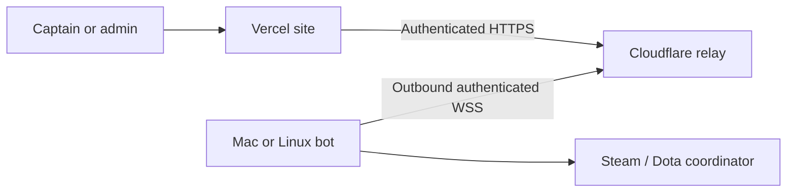

# Steam / Dota lobby bot

The default rollout is **one bot for the league's in-house games**, using **Captains Mode (2)** and **US East (2)**. The same bot can also serve Europe West (3) through the explicit shared-region setup below; it still hosts only one Dota lobby at a time across both leagues. It holds a lobby only until its game is running: it leaves once Dota gives the game a match id, so two in-house games can run at once, set up one after the other. Captains/admins create and start the lobby from the in-house room. Once the lobby is ready the bot invites the players in Dota ([Lobby invites](#lobby-invites)); participants see who is in the lobby, its status, and its name and password for anyone the invite misses. Draft completion alone does not create or launch a Dota lobby. Season support is implemented but its UI and API stay disabled unless the server explicitly sets `DOTA_SEASON_LOBBY_BOT_ENABLED="true"`.

## Architecture and research

Lobby creation uses a Steam client session and the Dota Game Coordinator (GC). The existing Steam Web API key/OpenID login cannot supply that session, and signing into the desktop Steam app does not sign in the worker. The web app sends authenticated requests through `ops/dota-lobby-relay` on Cloudflare to the separate Node 22 service in `ops/dota-lobby-bot`. The bot opens an outbound WebSocket to the relay and stays logged in to Steam. Its host needs no public IP, inbound firewall port, domain, or temporary tunnel.

The worker runs on macOS or Linux with Node 22 and persistent private storage. It does not need the Steam desktop app, the Dota download, a GPU, or ChatGPT to remain open. A Mac running the bot can coexist with a PC playing Dota on a different Steam account. Windows would require a Linux environment such as WSL; that path has not been tested.


```mermaid
flowchart LR
  Captain[Captain or admin] --> Site[Vercel site]
  Site -->|Authenticated HTTPS| Relay[Cloudflare relay]
  Bot[Mac or Linux bot] -->|Outbound authenticated WSS| Relay
  Bot --> Steam[Steam / Dota coordinator]
```

Primary sources inspected September 4, 2026:

- [SteamUser documentation](https://github.com/DoctorMcKay/node-steam-user): login, Steam Guard, persistent login data, and `gamesPlayed`.
- [Steam Session documentation](https://github.com/DoctorMcKay/node-steam-session): QR/password sign-in and SteamClient refresh tokens.
- [Dota2User setup](https://github.com/itsjfx/node-dota2-user/blob/master/docs/setup.md): attach the GC adapter to SteamUser and wait for the GC connection.
- [Dota lobby request protobufs](https://github.com/SteamDatabase/Protobufs/blob/master/dota2/dota_gcmessages_client_match_management.proto): `CMsgPracticeLobbyCreate`, nested lobby details, `leagueid`, game mode, region, launch and leave messages. SteamDatabase tracks Valve's shipped protocol definitions.
- [Dota shared lobby protobufs](https://github.com/SteamDatabase/Protobufs/blob/master/dota2/dota_gcmessages_common_lobby.proto): authoritative lobby snapshots and current member indices.
- [Node Dota lobby API documentation](https://github.com/dotabod/node-dota2-fork): the hosting account needs league admin permission to select a league ticket.

The published `dota2-user` package omits lobby request encoders. `lobby.proto` contains the small wire-compatible request subset; the installed adapter supplies the handshake and shared-object decoders. These are community libraries using Valve's protocol, so a Dota update can require adapter changes. The worker is isolated from the web bundle; its dependency licenses (including `dota2-user`'s GPL-3.0 license) remain in its dependency tree.

## Account and ticket setup

1. Create/use a **dedicated Steam account** with Dota 2 available. Log into Dota once and complete any account prompts. Do not also play from that account while the service is running.
2. Give that account permission to host under the in-house ticket through [Dota league administration](https://www.dota2.com/league/). Confirm that this account can actually select the ticket when testing a lobby.
3. Put the numeric ID of **Under 5k inhouse league** in the web app's `DOTA_INHOUSE_LEAGUE_ID`. The [OpenDota league list](https://api.opendota.com/api/leagues) lists this as **20004** (checked September 4, 2026). The separate **Under 5k** league is 20001. Season support, if enabled later, reads `Season.dotaLeagueId`.
4. Keep the worker host online during games. The relay supplies the stable HTTPS origin reachable by the web deployment. One configured service/account hosts **one lobby at a time**, until that game is running; another game's Create gets `BUSY` meanwhile (usually a few minutes). Multiple-account routing is not implemented. See [hosting options and costs](DOTA-BOT-HOSTING.md).

## Run the worker

From `ops/dota-lobby-bot`:

```sh
npm ci
cp .env.example .env
```

Fill the local `.env` with a fresh random `DOTA_LOBBY_BOT_SECRET` (generate with `openssl rand -hex 32`). Keep it out of Git and browser variables. Sign in once:

```sh
npm run login
```

Open the printed `state/steam-login.png` path, scan it using Steam Guard on your phone while signed into the **dedicated bot account**, then approve “GGD2L in-house lobby bot”. The QR code expires after five minutes and is deleted after approval/cancellation. If that account does not have mobile Steam Guard, enter its credentials directly in your own terminal instead:

```sh
npm run login -- --password
```

The password and any Steam Guard code are hidden and not saved. The helper supports email codes and mobile approval; append `--code` to prefer a code. Do not paste account credentials or codes into chat. A private `state/steam-auth.json` stores the renewable Steam session; the worker saves rotated tokens automatically. The helper and worker refuse overlapping sign-in processes for the same state. Start the worker after successful sign-in:

```sh
npm start
```

Retain the entire private state directory, including `steam-auth.json`, `steam/`, and the lobby JSON. Steam may require a new `npm run login` after account/security changes or token expiry. Stop the worker before signing in again. Username/password environment variables remain an optional fallback when no saved session exists; saved sessions take priority. Do not enable verbose `DEBUG` logs in production: upstream debug output can contain session/lobby data.

For a Linux service, adapt `ld2l-dota-bot.service` to your checkout and Node 22 binary. Create the `ld2l-bot` OS user, `/var/lib/ld2l-dota-bot` owned by that user, and a private `/etc/ld2l-dota-bot.env` containing the worker variables with `DOTA_BOT_STATE_DIR=/var/lib/ld2l-dota-bot`. Perform the interactive first login as that OS user with those same variables. Install and enable the unit only after login works.

The control server binds to `127.0.0.1:8090` for local diagnostics. For the deployed site, use the [relay setup](../ops/dota-lobby-relay/README.md). The relay is deployed at `https://ggd2l-dota-lobby-relay.ggd2l.workers.dev`. Its two separate secrets authorize site requests and bot connections. Steam session tokens stay on the bot host. WebSocket requests expire after ten seconds and are never replayed by the relay; the controller retains its own durable idempotency checks. An idle connection uses Cloudflare WebSocket hibernation.

Worker-only configuration:

```dotenv
DOTA_LOBBY_RELAY_URL="https://ggd2l-dota-lobby-relay.ggd2l.workers.dev"
DOTA_RELAY_WORKER_SECRET="<relay worker-connection secret>"
```

An independently managed HTTPS reverse proxy remains an alternative: forward only `/lobby` to the loopback service, preserve Authorization, cap bodies at 8 KiB, and apply request limits. No unauthenticated health endpoint discloses account or lobby details.

In the **web app** environment, configure:

```dotenv
DOTA_LOBBY_BOT_URL="https://ggd2l-dota-lobby-relay.ggd2l.workers.dev"
DOTA_LOBBY_BOT_SECRET="<same random secret as worker>"
DOTA_INHOUSE_LEAGUE_ID="<numeric in-house ticket ID>"
DOTA_SEASON_LOBBY_BOT_ENABLED="false"
```

Do not put `STEAM_BOT_USERNAME` or `STEAM_BOT_PASSWORD` in Vercel. Local web development can use `http://127.0.0.1:8090`; production requires HTTPS. Restart/redeploy the app after setting its environment. No database migration is needed.

## Sharing the existing bot between US and Europe

The approved shared setup keeps the existing Steam account, worker process,
private state directory, LaunchAgent and relay. Both web projects use the
existing relay's `DOTA_LOBBY_BOT_URL` and its matching `DOTA_LOBBY_BOT_SECRET`.
Set this explicit allowlist in the existing worker's private configuration:

```dotenv
DOTA_GAME_SERVER_REGIONS="2,3"
```

This overrides the singular `DOTA_GAME_SERVER_REGION` when present. Omitting
it preserves the existing single-region setting, defaulting to US East (2).
Only region IDs 2 and 3 are supported; malformed, duplicate or unknown entries
stop startup before Steam login. Do not start the separate `.env.eu` worker
or a second process with this Steam account.

The EU app generates `eu:inhouse:<id>:1` and `eu:season:<id>:<game>` keys.
US keys remain `inhouse:<id>:1` and `season:<id>:<game>`, preserving its existing
active jobs and history. In shared mode the worker accepts EU keys only with
region 3 and US keys only with region 2. Equal record IDs in the independent
databases therefore cannot select or release the other league's job. The
single durable active claim returns `BUSY` to either league while the other
owns a lobby, including during creation, reconnection and departure.

Each request retains its own app-selected ticket, region and roster. The bot
checks the actual lobby against both the original ticket/region and the
current request before launch. A shared Steam account needs permission for
each league's ticket: configure Europe's own numeric `DOTA_INHOUSE_LEAGUE_ID`,
ticket name and any season `dotaLeagueId` separately. Sharing the account
does not obtain or grant access to a Europe ticket.

Activation order:

1. Deploy the updated **existing** relay, using `npm run deploy` from
   `ops/dota-lobby-relay`; the protocol update preserves US keys and adds EU
   keys. The separate `deploy:europe` relay is unused for this shared path.
2. Finish/release any active bot lobby. Stop the existing service, deploy its
   reviewed worker code, add the allowlist, and start the same service with
   its existing state and credentials. Do not delete its saved job history.
3. Deploy the app namespace changes and point Europe at the shared relay.
   Keep season bot controls disabled until their own rehearsal is complete.
4. Verify US and EU create/release in sequence with their correct tickets and
   regions. While one owns the bot, verify the other receives `BUSY`. Complete
   a real game/result-import rehearsal before announcing automated hosting.

Relay requests receive fresh random correlation IDs. The worker only reuses
a cached result for an identical request; a conflicting request with the same
correlation ID fails without running another command or returning the earlier
request's result. There is no automatic queue or preemption between leagues.

## Mac background service

After sign-in, stop any foreground worker and run from `ops/dota-lobby-bot`:

```sh
node macos-service.mjs install --keep-awake
node macos-service.mjs status
```

The installed LaunchAgent `com.ggd2l.dota-lobby-bot` starts at Mac user login and restarts after a failure. It continues after ChatGPT or the terminal closes. `--keep-awake` prevents idle system sleep while running; keep the Mac powered and its lid open. Locking the screen or turning off the display is fine. Logout, shutdown, network loss, or lid sleep makes the bot unavailable.

Use `node macos-service.mjs stop` before signing in again or moving the bot to another host; `start` brings it back. `stop` returns only once launchd has unloaded the bot, so `start` can follow it straight away ([details](DOTA-BOT-HOSTING.md#running-on-this-mac)). `uninstall` removes the LaunchAgent without deleting private Steam state. Logs are private files under `state/logs/`. A Node runtime upgrade that removes the installed Node path requires reinstalling the service.

## Match-night flow

1. In-house controls appear once teams are drafted; either in-house captain or an admin clicks **Create Dota lobby**. Any live in-house game with locked teams can create/start a lobby; with two live, the second waits (`BUSY`) until the first game is running. The bot applies that league's in-house ticket, Captains Mode, its configured server region, a password, no cheats, no AI players, and a two-minute DotaTV delay. Each game has a unique name suffix.
2. When Dota confirms the configured settings, the panel shows **Lobby ready**. The bot removes itself from a playing slot and invites every roster player not already in the lobby, once ([Lobby invites](#lobby-invites)). A player accepts the popup in Dota and joins without the password, but lands on neither side: they take their own slot. Anyone the invite misses joins through Dota's Custom Lobbies browser with the panel's name/password. Season home team plays Radiant and away team Dire; in-house sides follow the draft's existing Radiant assignment. The panel shows both sides and, from a bot that invites, who of the roster is where.
3. **Start game with bot** verifies five current roster members on each assigned side, including approved stand-ins and linked Dota account overrides. A player who accepted an invite but has not taken a slot is not on a side yet. It does not auto-launch when the tenth player joins.
4. Once the GC reports the game running, the in-house page advances to In Progress on its next bot-status check (a visible tab). Recording does not wait for that: the scheduled worker reads the bot's status itself and, once the bot reports the launched game's match ID, looks that one match up on OpenDota instead of scanning ten players' histories. The match must pass the same checks as a pasted match ID — it started after the lobby formed, and at least two linked players from each drafted team are in it, on opposite sides — or nothing is recorded from it and the history scan takes over. The history scan also resumes if OpenDota still lacks the bot's match two hours after the lobby formed or was marked started (`INHOUSE.DETECT_BOT_MATCH_WAIT_MINUTES`). The bot never invents a result from lobby state; OpenDota's copy of the ticketed game is the result.
5. The worker leaves automatically once the game is running and Dota has given it a match id (or at postgame, whichever it sees first). The job keeps that match id, so the site still reads it for the result, and the bot is free for the other in-house game. Because the bot has left, it never sees the game end: when it does, a player presses **Game over — queue again** on `/inhouse`, which frees the ten to queue at once while the site keeps looking up the bot's match id on OpenDota ([inhouse: Game over](features/inhouse.md#game-over-result-pending)). That press is refused while this game's bot lobby is still unlaunched and the bot is online (creating, ready or starting): a captain starts it with **Start game with bot** or frees it with **Release bot…** first. A blocked bot (which is also what an offline one reports) never holds the press back; an admin releases it later with **Check bot connection**. A captain can still release it by hand once a game is running. If season support is enabled later, season captains get the same controls, with a new key/password after each imported game. Each Dota lobby is a separate Bo1 while the site's series score remains authoritative.

Manual hosting instructions remain available if the integration is disabled/offline. When using the bot, use its unique lobby name rather than the manual in-house lobby name. Release an existing bot lobby before switching to manual hosting.

## Lobby invites

The bot invites the players into its lobby so they needn't search Custom Lobbies for it. The lobby name and password stay on the panel as the fallback. The bot never kicks anyone and never moves anyone onto a side: an invited player lands unassigned and takes their own slot, and a stranger who takes a slot holds Start back (`ROSTER`) until they move. Tim's calls are in [DECISIONS](DECISIONS.md).

- **Automatic, once per job.** On the job's first ready snapshot (its own lobby, settings confirmed, the bot as leader, not releasing), the bot invites every player on the job's roster who is not already in the lobby, and stamps `autoInvitedAt` on the job in `lobbies.json`. Each invite is recorded there before it is sent, so a reconnect or restart never sends that round again. The Game Coordinator's answer then marks an invite `offline` if the player's Dota is closed. A send that throws (Steam dropped) is marked `failed` and never retried on its own; a re-invite sends it again. The bot never invites itself.
- **Re-invite missing players** (captains and admins) and **Send me an invite** (any other rostered player: an in-house game's drafted players, a season match's night roster including booked stand-ins). Re-invite shows only while the lobby is ready and someone on the roster is absent, and Send me an invite only while it is ready and the viewer is absent (`reinviteMissingOpen`, `selfInviteOpen` in `src/lib/dota-lobby.ts`). Both build on `lobbyInviteScope`, which is also what `POST /api/dota-lobby` accepts an `invite` by. A captain's or admin's invite names no targets, so the bot invites everyone on the fresh roster who is not in the lobby, a stand-in booked after create included. A player's names only their own playing Steam ID, the same one the spec's side carries (a linked Dota account override wins over the login). Anyone else gets 403, and a game that is not playable is refused before the bot is called. The route leaves "is the lobby ready" and "who is missing" to the bot rather than reading its status first, and an invite counts against the route's write limit.
- **Resend limits.** Every invite, automatic or pressed, skips anyone already in the lobby, anyone invited in the last 30 seconds (`INVITE_RESEND_MS`) and anyone invited five times in this job (`INVITE_MAX_PER_PLAYER`), so a repeated or retried press can't flood a player. The reply's `invited` count says how many went out; a press that sent none gets a toast saying whether everyone is already in or the limits held the resend back. A lost or timed-out answer is "may have gone out", never failed: on either leg, including the relay's `OFFLINE`, which it also answers for a reply it lost after delivering the command (`InviteOutcomeUnknownError`, which the route marks `unknown` for the panel's neutral toast).
- **Who's in the lobby.** While the lobby is ready, the panel lists each roster player against the side they belong on: on it, on the other side, in the lobby but on neither side ("In the lobby: needs a Radiant slot"), or absent with what became of their invite. Rows use Dota's side names, Radiant and Dire, because that is what the lobby shows; the panel above the list says which team is which. The browser gets names, sides, seats and invite results only; Steam IDs stay on the server (`lobbyPlayerViews`). The players' copy says to accept the invite (no password needed) and take a slot, and, for a player who sees no popup, to untick "Block party invites from non-friends" in Dota's settings and then get a new invite (the line names the viewer's own button, **Send me an invite** or **Re-invite missing players**, or says to ask a captain: `noPopupHelp`), or join with the name and password. Players are not asked to friend the bot.

What the bot reports for an absent player's invite, and what it means:

| `invite` | Meaning | Row |
| --- | --- | --- |
| `none` | No invite yet | Not invited yet |
| `sent` | The Game Coordinator accepted it. It may still be blocked by the player's Dota setting: a blocked invite looks exactly like a delivered one to the bot | Invite sent |
| `offline` | The player's Dota was closed. The invite pops up when they open Dota | Invite waiting: pops up when they open Dota |
| `failed` | The send threw because Steam dropped | Invite didn't send |

### Protocol

The full request and reply shapes are in the [relay README](../ops/dota-lobby-relay/README.md#protocol). In short:

- **`invite`** is a lobby action with the usual full spec, plus optional `invite` (1 to 20 unique Steam64 IDs, each on that request's own `radiant` or `dire`). Without `invite` the bot targets the whole fresh roster. The bot accepts it only for its active job in state `ready`, with its lobby in the UI state, the bot as leader, matching settings, and no launch or release under way; otherwise `409 STATE` or `409 SETTINGS`. Bad targets are `INVALID`, and an offline bot is `OFFLINE`. A 200 reply is the usual status plus `invited`, the number sent (0 to 20).
- **`withPlayers: true`** on any lobby action's spec adds `players` to a 200 reply while the job is ready or starting with its lobby in the UI state: one `{id, seat, invite}` per distinct roster ID, Radiant then Dire, at most 20, where `seat` is `radiant`, `dire`, `unassigned` or `absent`. Without `withPlayers` the reply is exactly what it was before invites.
- **The site** asks for `withPlayers` on every browser read and action, and reads the list strictly: anything malformed, or a list that doesn't match the roster ID for ID, is unknown and shows no list. The scheduled worker's status read never asks. A bot without invites ignores `withPlayers` (its spec check reads only the keys it knows) and sends no `players`, so the panel keeps its "Join through Dota → Play → Custom Lobbies" line and shows no list or invite buttons.

### Deploy order

Ship the three parts in this order, each only once the one before it is live:

1. **Relay** (`npm run deploy` from `ops/dota-lobby-relay`, the shared relay both leagues use). An older relay rejects `invite` with `400 INVALID` and turns any reply carrying `players` or `invited` into `409 STATE`, so nothing that sends either may go first.
2. **Bot**: update the worker code in the service's checkout and restart it (`node macos-service.mjs stop`, then `start`). Restart it while it holds no lobby: a lobby the old bot set up has no `autoInvitedAt`, so the restarted bot sends it one automatic round when it next sees it ready. From here the bot invites on every new lobby, whichever site is live; the old panel's name/password line is still right as the fallback.
3. **Site**, through [RELEASING](RELEASING.md) to both leagues (no migration). It is the only part that sends `withPlayers` or `invite`.

Roll back in reverse: site first, then bot, then relay. Rolling back the site or the bot alone is safe (an older bot ignores `withPlayers`; an older site never sends it). Never run an older relay while the new site and the new bot are both live: the bot's `players` would turn every panel read and action on a ready lobby into `409 STATE`, and a Start that really launched would read as failed.

## Recovery and limits

- Duplicate Create/Start requests are idempotent per fixture/game. Intent is written before sending to Steam. A lost HTTP response never triggers an automatic second lobby or launch.
- The worker stores `lobbies.json` atomically with private permissions. Keep this file across restarts: it holds active ownership, completed request IDs and each job's invite records (when each player was last invited, how many times, and the result). Do not rotate the shared secret mid-lobby; season passwords derive from it.
- On reconnect, the worker reconciles the account's actual GC lobby by its unique name/password. Wrong tickets/settings block launch. Check the bot account's ticket permissions rather than repeatedly clicking Create.
- A Steam or GC drop can swallow the departure from a launched game, which would leave its claim answering `BUSY` to every next Create. The next GC welcome that resends every cache and holds no lobby counts as that departure (`welcomed` in `controller.mjs`): the claim frees, the job keeps its match id, and the log reads "Reconnected outside the launched game's lobby". This also covers a worker restarted before the departure arrived. A welcome that still holds the running lobby makes the bot leave it again. A welcome never frees a creating, ready, starting or blocked job: those still need a deliberate release.
- Lobby names come from `src/lib/dota-lobby-service.ts`: `<INHOUSE.LOBBY_NAME> <id>` for in-house games and `<LEAGUE_CONFIG.name> <home> vs <away> G<n> <id>` for season games, so they read "GGD2L" (or "GGD2L Europe"), never "LD2L". The name is part of what the bot checks before starting, so a deploy that changes the format leaves any lobby still open unable to start: release it and create it again.
- A create/launch with no confirmation becomes **Lobby needs attention** after 30 seconds. An ambiguous create with no snapshot cannot be released until a fresh GC connection confirms no lobby exists. Restart the worker, check the Dota client, then refresh/release deliberately. A timed-out start is never silently replayed.
- If Steam or the Game Coordinator drops and the worker stays offline for five minutes after having connected, it logs the drop and exits non-zero so launchd/systemd start a fresh process. It never does this before its first connection or after a deliberate stop (wrong account, unsaved session, account playing elsewhere); those need an operator.
- A kernel lock on `worker.os-lock` prevents overlapping bot/login processes on a host and releases automatically on crash/reboot. **Never delete `worker.os-lock`**; keeping its inode preserves mutual exclusion. `worker.lock` is an informational PID marker and can be replaced safely by the next kernel-lock holder after a crash. Upgrading an old empty marker requires stopping the old worker first. Never run two hosts with the same Steam account. Keep state on a persistent local volume; Linux requires `util-linux`'s `flock`.
- **Release bot** leaves the existing lobby; it does not destroy it or abandon a running match. Players may remain in that lobby. A release waits for GC departure before the service accepts another fixture. Check the old lobby before deliberately recreating one.
- If an in-house lobby is cancelled, completed or marked over (its result on the way) while still holding the worker, admins see recovery controls on `/inhouse` and can use **Check bot connection**. Discovery returns only a closed in-house ID, and its controls allow an explicit release with no create/start. Captains can also use the scoped `release` API for their own historical lobby. If a season's game counter has already advanced, the operator can release the old request through the worker's authenticated `/lobby` endpoint using its original spec from private `lobbies.json`. The website never automatically destroys live Dota lobbies.
- Automated verification covers simulated GC events and the installed wire encoder/decoder. **A real Steam lobby and a ticketed completed game must still be tested before match-night use.**

## Verification

```sh
npm test --prefix ops/dota-lobby-bot
npm test --prefix ops/dota-lobby-relay
npx vitest run src/lib/dota-lobby.test.ts src/components/dota-lobby-controls.test.ts
npx vitest run --config vitest.integration.config.mts test/integration/dota-lobby.itest.ts test/integration/dota-lobby-recovery.itest.ts
npx tsc --noEmit
```

The worker lockfile pins its dependencies. Overrides update vulnerable transitive `steam-appticket` protobufjs and `steam-user` adm-zip versions; the adapter smoke test checks the resulting installed packages. Run `npm audit --prefix ops/dota-lobby-bot` when updating them.

Local verification for the original implementation: 2,252 existing unit tests passed. The production build, TypeScript, and scoped ESLint checks passed. Browser checks exercised season create/start/release and in-house create/start against an isolated fixture database and a simulated GC transport. The in-house row advanced to `IN_PROGRESS`; the 375px layout had no horizontal overflow or page errors. After restricting rollout to in-house and adding admin recovery, 38 database/API integration tests, TypeScript, and scoped ESLint passed. The worker now has 25 passing tests covering Steam-session storage, controller races and installed protocol compatibility. A terminal check verified hidden password input and Ctrl+C cleanup without submitting credentials. The worker dependency audit reported no known vulnerabilities. These automated checks did not log in to Steam.

For live acceptance: create an in-house lobby, verify Captains Mode/US East/ticket 20004 in Dota, populate the drafted sides, start it, and confirm the result imports. Test a restart while the lobby is open and confirm there is still exactly one lobby. Season-ticket and successive-series-game acceptance are deferred until that rollout is enabled.

Live verification on September 4, 2026: Steam Guard sign-in succeeded; the Mac LaunchAgent connected to Steam, Dota and the deployed Cloudflare relay. Through the authenticated HTTPS relay, the bot created Dota lobby `30007027938516500`; the GC confirmed Captains Mode (2), US East (2), and league 20004. The bot released that test lobby and returned to available. Authenticated control returned HTTP 200 and unauthenticated control returned HTTP 401. No players were invited and no game was launched. A complete ten-player start and result import still require a real in-house game.

The Vercel production deployment `dpl_EkWgUF7sQm5xJihbZAa1VVa8SsKT` was built from commit `a218bfa` and promoted to `https://ggd2l.vercel.app`. Its build and production schema attestation passed without database changes. The signed-in admin browser on `/inhouse` displayed **Bot online** and the connected Steam account; the manual connection check used the live site API and relay. Anonymous recovery requests returned HTTP 401. Final focused verification passed 40 site/API integration tests, 33 worker tests and 12 relay tests, plus TypeScript and scoped ESLint.

Shared-worker activation on September 5, 2026: the existing relay was deployed
as version `1445c2cb-19a4-4852-9d09-09e2c027c8b0`, retaining its encrypted
secrets. At 09:34:52 UTC the bot was verified online with no active key or Dota
lobby immediately before stopping the existing LaunchAgent. Its private
configuration was backed up outside the repository and only
`DOTA_GAME_SERVER_REGIONS="2,3"` was added; its Steam session, existing state,
relay and service identity were retained. After the same service restarted,
authenticated health returned online for Steam account `76561198148555134`.
At 09:36:45 UTC both US and namespaced EU read-only status probes returned
HTTP 200/idle, an EU key with the US region was rejected, and the bot still
had no active lobby. These probes did not create, launch or select a ticket
in Dota. Europe still requires its ticket configuration/permission and a real
game rehearsal. No US Vercel deployment was performed during this activation.

The private backup includes rollback instructions. To return the worker to
US-only operation, first disconnect Europe's bot controls and confirm the
shared bot is idle. Stop the existing service, restore the original private
environment file with mode 0600, then start the same service. Keep its current
namespace-compatible relay and saved Steam/lobby state; do not start a second
instance or delete lock files.

Invite live test on October 10, 2026, 16:21 to 16:28 UTC, with the real bot
account and Tim's Steam account. It checked the bot's invite path; the site's
list and invite buttons were checked against a fixture database and a
simulated bot only.

- The invite popup appeared in Dota within seconds. Accepting it joined the
  lobby without the password, and the player landed unassigned (on neither
  side) and had to take their own slot.
- A repeat invite to the same account arrived again.
- A player who is not Steam friends with the bot received it, with the block
  setting off.
- With Dota's "Block party invites from non-friends" ticked, nothing appeared,
  yet the Game Coordinator still answered "invite created" (not offline). The
  bot cannot tell a blocked invite from a delivered one, so `sent` never
  proves delivery and the panel names the setting.
- With Dota closed, the Game Coordinator answered "player offline"; the invite
  popped up when the player later opened Dota.
